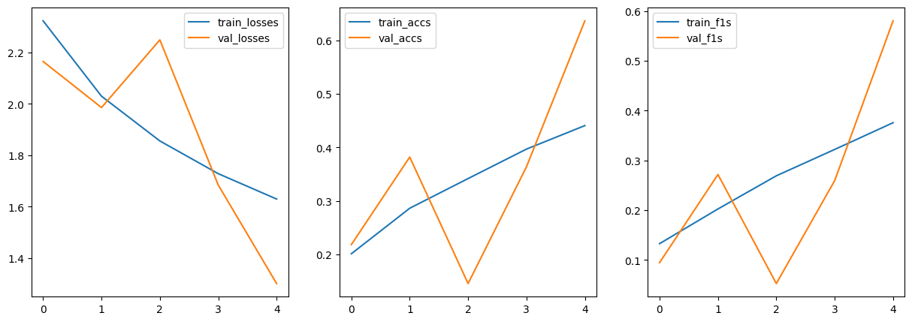

# Plants Species Classifier

In the realm of machine learning, the combination of innovative model architectures and scalable deployment solutions is key to turning theoretical advancements into practical applications. Vision Transformers (ViTs), a pioneering architecture initially developed for image recognition tasks, have recently emerged as a powerful tool in the field of plant species classification. Leveraging the capabilities of ViTs, we can now address complex botanical challenges with unprecedented accuracy. This blog explores the journey of developing a Plant Species Classifier using the Vision Transformer model in PyTorch and seamlessly deploying it on AWS SageMaker. Here, I'll walk through the end-to-end process—from model training and evaluation to the deployment of a robust, scalable endpoint—highlighting how SageMaker simplifies the deployment and management of machine learning models in production environments.

## Data

The cornerstone of any effective machine learning model is a robust dataset. For the purpose of this project, I utilized the "Plant Species Dataset," accessible through Kaggle. This dataset is meticulously organized into training and validation directories, featuring images from 14 distinct plant species. Each directory is designed to facilitate the direct training and validation of our model, ensuring that it learns to recognize and differentiate between various species with a high degree of accuracy.

- Training Data: This directory contains a large set of images for each of the 14 species, which are used to train the model. The diversity and volume of the images ensure that the model can learn varied features of each plant species under different conditions.
- Validation Data: The validation directory serves to evaluate the model during the training process, providing a way to gauge its performance on unseen data. This helps in tuning the model parameters appropriately.
- Testing Data: In addition to the training and validation images, the dataset includes a separate test directory with a few images for each species. This set is crucial for performing the final evaluation of the model, mimicking how the classifier would perform in real-world scenarios once deployed.

The dataset’s format and structure are ideal for feeding directly into a Vision Transformer, which thrives on rich, diverse datasets to develop a generalized understanding of the subject matter. Next, we will explore how we preprocess this data to optimize it for training our Vision Transformer model using PyTorch.

## Data Preparation

Proper data preparation is crucial for effective model training and generalization to unseen images. For my Plant Species Classifier, I focused on key steps of data augmentation and normalization to enhance model performance:

- Data Augmentation: Variability in natural conditions requires diverse training data. Techniques like random resizing, horizontal flipping, color adjustments, and random rotation were applied to augment training images, simulating real-world scenarios.
- Validation Data: Validation images were resized to ensure consistency during evaluation.
- Normalization: Post-augmentation, images were transformed into tensors and normalized to align with model expectations, enhancing training dynamics and convergence.

Implementing these steps using PyTorch's transforms module ensured the model's exposure to varied conditions, fostering a robust understanding of different plant species

## Model

The Vision Transformer (ViT) represents a departure from traditional CNNs, using self-attention to process image patches. ViTs break images into patches, transform them into embeddings, and process them using multi-head self-attention and feed-forward networks.

For my Plant Species Classifier, I used the vit_b_16 pretrained model from torchvision.models. I adapted the model by replacing the classification head to output 14 classes, aligning with my dataset of 14 plant species.

This setup ensures that the model leverages pretrained knowledge while tailoring its capabilities to the specific task of identifying and classifying plant species.

## Training

To initiate model training for my Plant Species Classifier, I began with a conservative approach of 5 epochs using standard training components:

- Loss Function: Utilized CrossEntropy Loss, suitable for multi-class classification tasks like ours.
- Optimizer: Employed the Adam optimizer, known for its efficiency in optimizing deep learning models.

This initial training phase allowed me to gauge the model's performance and iterate upon it further to achieve optimal accuracy and generalization for the plant species classification task.

## Deployment

After training my Plant Species Classifier model, the next step was deploying it on a SageMaker endpoint to make real-time predictions. I leveraged the SageMaker SDK, specifically the sagemaker.pytorch.PyTorchModel object, for seamless deployment and inference capabilities.

### Deploying the Model

Using the sagemaker.pytorch.PyTorchModel object, I followed these steps to deploy the trained model:

1. Configuration: Set up the PyTorch model configuration, specifying the model artifacts (trained model file) and the framework version.
2. Model Deployment: Deployed the model to a SageMaker endpoint, ensuring scalability and accessibility for inference.

### Inference Using the Endpoint

Once the model was deployed, I utilized the SageMaker endpoint for making predictions on new data:

1. Data Input: Provided input data in the required format (e.g., image tensors) to the SageMaker endpoint.
2. Inference: Sent inference requests to the endpoint, which processed the input data using the deployed model.
3. Output: Received predictions (e.g., predicted plant species) from the endpoint, enabling real-time inference for classification tasks.

### Benefits of SageMaker Endpoint

Deploying the model on a SageMaker endpoint offered several advantages:

- Scalability: Easily scaled to handle varying inference loads.
- Cost-Efficiency: Pay-per-use pricing model for inference.
- Real-Time Predictions: Instantaneous predictions for deployed models.

This deployment strategy using SageMaker SDK facilitated efficient deployment and utilization of the trained model, making it accessible for practical use in plant species classification applications.

